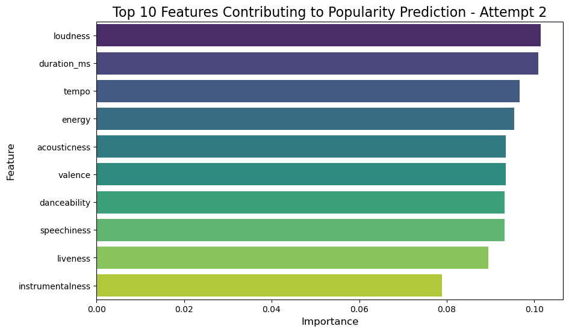

# Predicting Popularity of Spotify Music Tracks

## Table of Contents

[Overview](#overview)

[Instructions](#instructions)

[Data](#data)

[Analysis](#analysis)

[Conclusion](#conclusion)

[Presentation](#presentation)

[The Team](#the-team)

## Project Overview

### Overview

This project aims to predict the popularity of Spotify music tracks based on a song's features recorded on the Spotify API. These features include danceability, energy, key, loudness, speechiness, acousticness, instrumentalness, liveness, valence, tempo and duration. Specifically, we looked at how the different features impact a song's popularity as measured by Spotify.

#### Questions we aim to answer

1. Is there a correlation between a song's features and its popularity?
2. What feature has the highest importance in a song's popularity?
3. How accurately can a song's popularity be predicted based on its features?

### Instructions

#### Setup

1. Install Dependencies: Ensure that the following libraries are installed:
    
    import pandas as pd  
    import matplotlib.pyplot as plt  
    import seaborn as sns  
    import numpy as np  
    from sklearn.preprocessing import StandardScaler, LabelEncoder  
    from sklearn.model_selection import train_test_split, GridSearchCV  
    from sklearn.metrics import accuracy_score, classification_report, confusion_matrix  
    from sklearn.neighbors import KNeighborsClassifier  
    from sklearn.ensemble import RandomForestClassifier, GradientBoostingClassifier  
    from sklearn.linear_model import LogisticRegression  
    

2. Run the Analysis: Open and executethe notebook [combined_analysis.ipynb](combined_analysis.ipynb) in a Jupyter Notebook or Jupyter Lab.

#### Logic Overview

[combined_analysis.ipynb](combined_analysis.ipynb) is the main notebook for training and testing data, and predicting results.

1. Read the following CSV files from [./Resources](./Resources/):

       spotify_songs

2. Step 1: Data Cleaning  
   First Attempt 
   
        Drop rows with duplicate track_id and track-name.

        Drop rows with missing or zero track_popularity.
   
        Drop columns that will not be used in analyzing the data:
            track_id
            track_album_release_date
            playlist_genre
            track_name
            track_artist
            track_album_id
            playlist_subgenre
            track_album_name
            playlist_name
            playlist_id
            mode
            
        Divide track-popularity into 4 tiers:
            0 ~ 31  : Not Popular
            32 ~ 48 : Neutral
            49 ~ 63 : Popular
            64 ~ 100: Very Popular

        Split data into train and test

        Encode and scale 'key' column

   Second Attempt
        
        Drop rows with duplicate track_id and track-name.

        Drop rows with missing or zero track_popularity.
   
        Drop columns that will not be used in analyzing the data:
            track_id
            track_album_release_date
            playlist_genre
            track_name
            track_artist
            track_album_id
            playlist_subgenre
            track_album_name
            playlist_name
            playlist_id
         
        Normalize numerical columns
        
        Divide track-popularity into 3 tiers:
            0 ~ 31  : Low
            32 ~ 63 : Medium
            64 ~ 100: High

        Split data into train and test
          
3. Modeling  
   First attempt

        Apply and evaluate accuracy of various prediction models
            K Neighbors Classifier
            Logistic Regression
            Random Forest Classifier

    Second attempt

        Apply and evaluate accuracy of various prediction models
            Gradient Boosting Classifier
            Logistic Regression
            Random Forest Classifier with GridSearch
            
### Data
The dataset is sourced from [Kaggle's Spotify Songs Dataset](https://www.kaggle.com/datasets/joebeachcapital/30000-spotify-songs/)

Data Dictionary
|variable                 |class     |description |
|:---|:---|:-----------|
|track_id                 |character | Song unique ID|
|track_name               |character | Song Name|
|track_artist             |character | Song Artist|
|track_popularity         |double    | Song Popularity (0-100) where higher is better. The popularity is calculated by algorithm and is based mainly on the total number of plays the track has had and how recent those plays are. |
|track_album_id           |character | Album unique ID|
|track_album_name         |character | Song album name |
|track_album_release_date |character | Date when album released |
|playlist_name            |character | Name of playlist |
|playlist_id              |character | Playlist ID|
|playlist_genre           |character | Playlist genre |
|playlist_subgenre        |character | Playlist subgenre|
|danceability             |double    | Danceability describes how suitable a track is for dancing based on a combination of musical elements including tempo, rhythm stability, beat strength, and overall regularity. A value of 0.0 is least danceable and 1.0 is most danceable. |
|energy                   |double    | Energy is a measure from 0.0 to 1.0 and represents a perceptual measure of intensity and activity. Typically, energetic tracks feel fast, loud, and noisy. For example, death metal has high energy, while a Bach prelude scores low on the scale. Perceptual features contributing to this attribute include dynamic range, perceived loudness, timbre, onset rate, and general entropy. |
|key                      |double    | The estimated overall key of the track. Integers map to pitches using standard Pitch Class notation . E.g. 0 = C, 1 = C♯/D♭, 2 = D, and so on. If no key was detected, the value is -1. |
|loudness                 |double    | The overall loudness of a track in decibels (dB). Loudness values are averaged across the entire track and are useful for comparing relative loudness of tracks. Loudness is the quality of a sound that is the primary psychological correlate of physical strength (amplitude). Values typical range between -60 and 0 db.|
|mode                     |double    | Mode indicates the modality (major or minor) of a track, the type of scale from which its melodic content is derived. Major is represented by 1 and minor is 0.|
|speechiness              |double    | Speechiness detects the presence of spoken words in a track. The more exclusively speech-like the recording (e.g. talk show, audio book, poetry), the closer to 1.0 the attribute value. Values above 0.66 describe tracks that are probably made entirely of spoken words. Values between 0.33 and 0.66 describe tracks that may contain both music and speech, either in sections or layered, including such cases as rap music. Values below 0.33 most likely represent music and other non-speech-like tracks. |
|acousticness             |double    | A confidence measure from 0.0 to 1.0 of whether the track is acoustic. 1.0 represents high confidence the track is acoustic.|
|instrumentalness         |double    | Predicts whether a track contains no vocals. "Ooh" and "aah" sounds are treated as instrumental in this context. Rap or spoken word tracks are clearly "vocal". The closer the instrumentalness value is to 1.0, the greater likelihood the track contains no vocal content. Values above 0.5 are intended to represent instrumental tracks, but confidence is higher as the value approaches 1.0. |
|liveness                 |double    | Detects the presence of an audience in the recording. Higher liveness values represent an increased probability that the track was performed live. A value above 0.8 provides strong likelihood that the track is live. |
|valence                  |double    | A measure from 0.0 to 1.0 describing the musical positiveness conveyed by a track. Tracks with high valence sound more positive (e.g. happy, cheerful, euphoric), while tracks with low valence sound more negative (e.g. sad, depressed, angry). |
|tempo                    |double    | The overall estimated tempo of a track in beats per minute (BPM). In musical terminology, tempo is the speed or pace of a given piece and derives directly from the average beat duration. |
|duration_ms              |double    | Duration of song in milliseconds |

### Analysis
Based on the distribution of songs' popularity, data was initially grouped into 4 tiers. Applying 3 different prediction models yielded accuracy scores of under 0.50. In an attempt to improve the accuracy scores, the data cleaning process was modified as follows:

        - Group data into 3 tiers
        - Normalize numerical columns using Standard Scaler
        - Apply other prediction models
        
These modifications resulted in significantly improved accuracy scores.

    
|First Attempt                  |Second Attempt      |
|:---|:-----------|
|Logistic Regression: 0.3283 |Logstic Regression: 0.5008
|K Neighbors Classifier: 0.3497 |Gradient Boosting Classifier: 0.5174
|Random Forest Classifier: 0.4537 |Random Forest Classifier with GridSearch: 0.6454

Popularity  
Majority of the music tracks popularity tiers follow a normal bell curve.

Actual vs Predicted  

    

Confusion Matrix  

    

Trends in Popularity  
Majority of the music tracks in the data set was released after 2010.

    

    
### Conclusion

1. **Is there a correlation between a song's features and its popularity?**

Based on the results of the correlation matrix, there is no strong correlation between audio features and a song's popularity.

    
|Feature                  |Correlation      |
|:---|:-----------|
|danceability | 0.064748
|energy | -0.109112
|key |-0.000650
|loudness | 0.057687
|speechiness | 0.006819
|instrumentalness | -0.149872
|liveness | -0.054584
|valence |  0.033231
|tempo | -0.005378
|duration_ms | -0.143682

 
    
2. **What feature has the highest importance in a song's popularity?**  

9 of the 11 features analyzed contribute more than 0.08 in predicting a song's popularity. Loudness ranks the highest at just under 0.10, followed closely by duration_ms. These results are consistent with both attempts.

Features Importance - Initial Model  
 

Features Importance - Updated Model  

Features Correlation  

 
    
3. **How accurately can a song's popularity be predicted based on its features?**

The best-performing model (Random Forest Classifier with GridSearch) achieved an accuracy of 64.54%, showing moderate prediction capability. 

This analysis reveals that a song's features should not be relied upon to predict a song's popularity. We suspect that predicting songs' popularity is a complex undertaking because popularity is influenced by a mix of musical attributes, artists' marketing campaigns, social factors, cultural events and other factors.

    
## Presentation
    
[Predicting Popularity of Spotify Music Tracks Presentation](https://docs.google.com/presentation/d/1A1UIn5NqvjHRTJLpvWl-ElxfM1_YhF4gqIRhxEyoUus/edit#slide=id.g32c3d631087_1_10)

## The Team

[stellasyyun](https://github.com/stellasyyun)

[ttsai19](https://github.com/ttsai19)

[cfleming22](https://github.com/cfleming22)

[GIBueno25](https://github.com/GIBueno25)
